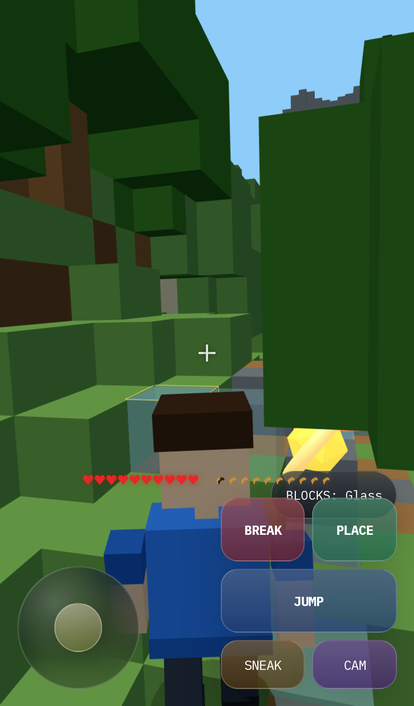

# JamesCraft

JamesCraft is a browser-based voxel survival game built with Three.js, Vite, and TypeScript. It includes procedural terrain, biomes, caves and ores, a day/night cycle, mobs, block editing, and UI that works on both desktop and mobile.

The current playable scope covers exploration, mining, building, combat, and survival HUD systems. The full crafting and smelting loop is still in progress.




## Implemented

- Three.js r183 + Vite + TypeScript
- 16 x 16 x 128 chunks with face-culled chunk meshes and chunk load/unload
- Simplex noise terrain generation
- 8 biomes: Plains, Forest, Desert, Tundra, Mountains, Swamp, Taiga, and Birch Forest
- Trees, caves, water, lava, and coal / iron / gold / diamond ore generation
- First-person and third-person camera modes with a blocky player avatar
- Gravity, jumping, sneaking, swimming, and AABB collision
- DDA-based block targeting with break and place interactions
- 9-slot build bar, inventory screen, pause/settings/death UI
- Hearts, hunger, fall damage, death, and respawn
- Simple AI for pigs, cows, zombies, skeletons, and creepers
- Web Audio API sound effects
- `localStorage` persistence for settings and player block edits
- A spawn-area playground with stars, jump pads, rings, and bridge objectives

## Controls

Desktop:

- `Click` or `SINGLEPLAYER`: start the game / enter pointer lock
- `WASD`: move
- `Space`: jump
- `Shift`: sneak
- `Left Click`: primary action
- `Hold Left Click`: continue breaking a block
- `Right Click`: place a block
- `1-9`: switch build-bar slot
- `E`: open inventory
- `V`: toggle first-person / third-person
- `P`: pause
- `Esc`: release pointer lock / return to menu
- `F2`: toggle HUD
- `F3`: toggle debug overlay

Mobile:

- `PLAY`: start the game
- Left joystick: move
- `LOOK` zone: look around
- `JUMP`: jump
- `BREAK`: primary action
- `PLACE`: secondary action
- `SNEAK`: sneak
- `CAM`: toggle first-person / third-person
- `BLOCKS`: expand and switch the build bar

## Local Development

CI uses Node.js 24. Using a similar local version is recommended.

```bash
npm install
npm run dev
```

The Vite dev server runs at `http://127.0.0.1:5173`.

```bash
npm run build
npm run preview
```

## Playwright QA

If Playwright browsers are not installed yet, run this once:

```bash
npx playwright install chromium
```

Local desktop smoke test:

```bash
npm run dev
npm run qa:local
```

Mobile smoke test:

```bash
npm run dev
npm run qa:mobile
```

Public build check:

```bash
npm run qa:public
```

- `qa:local` verifies core desktop interactions.
- `qa:mobile` verifies the touch UI using iPhone 13 emulation.
- `qa:public` defaults to `https://awano27.github.io/voxel-sandbox-threejs/`.
- `TARGET_URL` and `SCREENSHOT_PATH` can be overridden with environment variables.
- Generated screenshots are saved under `docs/`.

## Deployment

Pushing to `main` triggers GitHub Actions to run `npm ci`, build the project with `npm run build`, and publish `dist/` to the `gh-pages` branch.

If you change the GitHub Pages path, update at least these two places together:

- `vite.config.ts` `base`
- `scripts/qa-public.mjs` default `TARGET_URL`

## Directory Structure

```text
src/
  main.ts
  VoxelSandboxGame.ts
  constants.ts
  gameplay/
    FeedbackEffects.ts
    GameAudio.ts
    Inventory.ts
    MobSystem.ts
    Playground.ts
    Survival.ts
  player/
    InputController.ts
    Player.ts
    PlayerAvatar.ts
  world/
    Biome.ts
    BlockTypes.ts
    Chunk.ts
    ChunkManager.ts
    DDA.ts
    SimplexNoise.ts
    SkyRenderer.ts
    TerrainGenerator.ts
    VoxelMeshBuilder.ts
    World.ts
scripts/
  qa-local.mjs
  qa-mobile.mjs
  qa-public.mjs
docs/
  local-playwright-check.png
  mobile-playwright-check.png
  public-playwright-check.png
```
