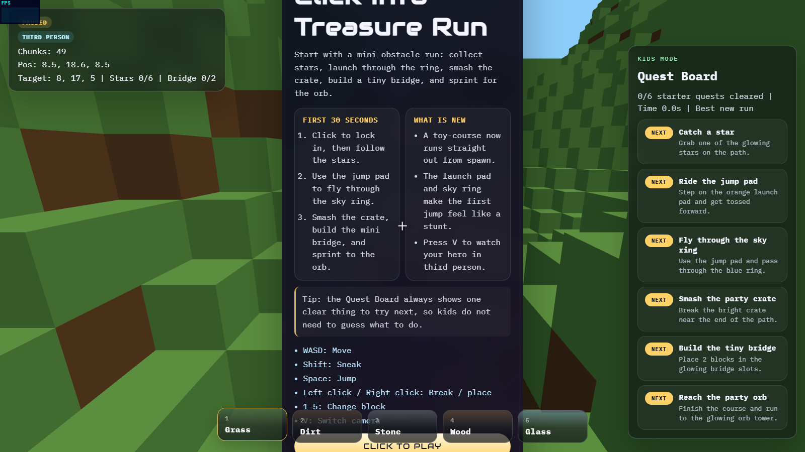

# voxel-sandbox-threejs

ブラウザで即遊べる Minecraft 風ボクセルサンドボックスです。Three.js r183、Vite、Pointer Lock、一人称移動、DDA ブロック選択、チャンクメッシュ最適化、AABB 物理に加えて、スマホ向けタッチ操作と Roblox 風のブロッキーな三人称アバターを実装しています。

公開 URL: https://awano27.github.io/voxel-sandbox-threejs/



## Features

- Three.js + Vite + TypeScript 構成
- 16 x 16 x 64 チャンクと面カリング済み merged geometry
- Simplex Noise ベースの自然地形
- PointerLockControls による一人称視点
- Roblox 風のブロッキーなアバターと歩行アニメーション
- `V` キー / `CAM` ボタンで一人称と三人称を切り替え
- スマホ向け仮想スティック、LOOK パッド、JUMP / BREAK / PLACE / SNEAK ボタン
- 重力、ジャンプ、AABB 衝突判定
- DDA による精密なブロック選択
- 左クリック破壊、右クリック設置
- 1-5 キーで Grass / Dirt / Stone / Wood / Glass を切り替え
- Stats.js による FPS 表示

## Controls

PC:

- Click: Pointer Lock 開始
- ESC: Pointer Lock 解除
- WASD: 移動
- Shift: スニーク
- Space: ジャンプ
- 左クリック / 右クリック: 破壊 / 設置
- 1-5: ブロック切替
- V: 一人称 / 三人称

Mobile:

- 左スティック: 移動
- 右 LOOK: 視点移動
- JUMP: ジャンプ
- BREAK: ブロック破壊
- PLACE: ブロック設置
- SNEAK: スニーク
- CAM: 一人称 / 三人称
- ホットバータップ: ブロック切替

## Local Development

```bash
npm install
npm run dev
```

Vite は `http://127.0.0.1:5173` で起動します。

## Playwright QA

ローカル確認:

```bash
npm run dev
npm run qa:local
```

モバイル確認:

```bash
npm run dev
npm run qa:mobile
```

公開 URL 確認:

```bash
npm run qa:public
```

生成されたスクリーンショットは `docs/` 配下に保存されます。

## Deployment

`main` ブランチに push すると GitHub Actions が `npm run build` を実行し、成果物を `gh-pages` ブランチへ自動デプロイします。

## Project Structure

```text
src/
  main.ts
  VoxelSandboxGame.ts
  player/
    InputController.ts
    Player.ts
    PlayerAvatar.ts
  world/
    BlockTypes.ts
    Chunk.ts
    ChunkManager.ts
    DDA.ts
    SimplexNoise.ts
    TerrainGenerator.ts
    VoxelMeshBuilder.ts
    World.ts
scripts/
  qa-local.mjs
  qa-mobile.mjs
  qa-public.mjs
```
